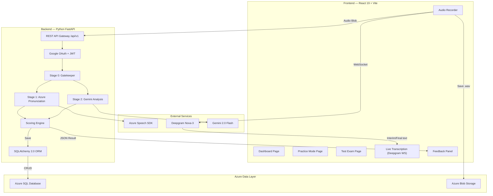

# Architecture Overview — LexiLearn IELTS Speaking System

> **Last updated:** 2026-04-04  
> **Stack:** React 19 + Vite | Python FastAPI | Azure SQL + Blob | Gemini 2.0 Flash

---

## System Architecture



---

## Technology Stack

| Layer | Technology | Purpose |
|-------|-----------|---------|
| Frontend Framework | React 19 + Vite | SPA with lazy-loaded pages |
| Styling | TailwindCSS + custom design system | Dark mode, glassmorphism, micro-animations |
| State Management | React Context (Auth) + local state | Lightweight, no Redux needed |
| Backend Framework | FastAPI (Python 3.11+) | async REST API with OpenAPI docs |
| ORM | SQLAlchemy 2.0 + pyodbc | Azure SQL Server connectivity |
| Auth | Google OAuth (`authlib`) + JWT (`python-jose`) | 24-hour token expiry |
| AI: Transcription | Deepgram Nova-3 | REST API for assessment, WebSocket for live |
| AI: Pronunciation | Azure Speech SDK | Accuracy, Fluency, Prosody, Completeness |
| AI: Linguistics | Gemini 2.0 Flash | FC, LR, GRA analysis + model answer |
| AI: Gatekeeper | Gemini embeddings | Relevance check before expensive analysis |
| Storage: SQL | Azure SQL Database | Users, topics, questions, sessions, answers |
| Storage: Blob | Azure Blob Storage | Audio recordings (.wav) |

---

## Assessment Pipeline (< 8s target)

```
Audio Upload
    │
    ▼
[0] Audio Preprocessing (pydub → 16kHz mono WAV)
    │
    ▼
[1] Deepgram Transcription (REST, ~1-2s)
    │
    ├──────────────────────────┐
    ▼                          ▼
[2a] Gatekeeper            [2b] Azure Pronunciation
     (relevance check)          (SDK, ~2-3s)
     (~0.5s)                    │
    │                          │
    └──────────┬───────────────┘
               ▼
[3] LLM Analysis — Gemini 2.0 Flash (~2-3s)
    (FC, LR, GRA scores + Vietnamese feedback + model answer)
    │
    ▼
[4] Scoring Engine
    (Pronunciation band, Overall band, Color-coded transcript)
    │
    ├──► DB Persistence (practice_answers / test_answers)
    └──► Blob Upload (audio .wav)
```

**Parallelization:** Steps 2a + 2b run concurrently via `asyncio.gather()`.  
Step 3 (LLM) depends on Azure results for `azure_brief` context.

---

## Database Schema

### Tables

| Table | Purpose | Key Columns |
|-------|---------|-------------|
| `users` | User profiles + streak tracking | `id` (Google Sub), `email`, `day_streak`, `estimated_band` |
| `topics` | IELTS topic categories | `id` (UUID), `name`, `part`, `order_index` |
| `questions` | Official question bank | `id` (UUID), `question_text`, `model_answer`, `cue_card_json`, `cefr_level` |
| `custom_questions` | User-added questions | `id` (UUID), `user_id` FK, `question_text`, `part` |
| `practice_sessions` | Groups practice answers | `id` (UUID), `user_id` FK, `topic_id` FK |
| `practice_answers` | Individual practice results | All Azure sub-scores + IELTS bands + word_details JSON |
| `test_sessions` | IELTS test exam sessions | `examiner_voice`, `question_count`, `overall_band` |
| `test_answers` | Test exam answers | `test_session_id` FK, `part_number`, `overall_band` |

### Security
- **User isolation:** All queries filter by `user_id` from JWT (never from client input)
- **API keys:** All external service keys are server-side only
- **Deepgram frontend key:** Proxied through authenticated `/auth/config/deepgram` endpoint

---

## API Endpoints

| Method | Path | Auth | Purpose |
|--------|------|------|---------|
| `POST` | `/api/v1/auth/google` | ✗ | Exchange Google token → JWT |
| `GET` | `/api/v1/auth/me` | ✓ | Get current user profile |
| `GET` | `/api/v1/auth/config/deepgram` | ✓ | Get Deepgram key for live transcription |
| `GET` | `/api/v1/user/dashboard` | ✓ | Dashboard aggregation |
| `GET` | `/api/v1/user/history` | ✓ | Practice history (paginated: `limit`, `offset`) |
| `GET` | `/api/v1/topics` | ✓ | List topics (filter: `?part=1\|2\|3`) |
| `GET` | `/api/v1/topics/{id}/questions` | ✓ | Questions for a topic |
| `GET` | `/api/v1/questions` | ✓ | List questions (filter: `?part=1\|2\|3`) |
| `POST` | `/api/v1/questions/custom` | ✓ | Create custom question |
| `GET` | `/api/v1/questions/custom` | ✓ | List user's custom questions |
| `POST` | `/api/v1/speech/assess` | ✓ | Full assessment pipeline |
| `POST` | `/api/v1/speech/explain-more` | ✓ | Deeper AI analysis per criterion |
| `POST` | `/api/v1/test/start` | ✓ | Start test session |
| `POST` | `/api/v1/test/{id}/answer` | ✓ | Submit test answer |
| `POST` | `/api/v1/test/{id}/complete` | ✓ | Complete test session |
| `GET` | `/api/v1/test/{id}/report` | ✓ | Get test report |
| `GET` | `/api/v1/test/history` | ✓ | Test session history |

---

## Scoring Formula

```
Pronunciation Band = map_to_ielts(0.6 × Accuracy + 0.2 × Fluency + 0.2 × Prosody)
Overall Band = round_ielts((FC + LR + GRA + Pronunciation) / 4)
```

**IELTS Rounding:** Round to nearest 0.5 (e.g., 6.25 → 6.5, 6.74 → 6.5, 6.75 → 7.0)

---

## Frontend Pages

| Page | Route | Key Components |
|------|-------|----------------|
| Dashboard | `/` | StreakCounter, DailyMission, BandEstimate, ContributionHeatmap, FeatureCards, ForecastProgress |
| Practice | `/practice`, `/practice/:partId` | TopicSidebar, QuestionGrid, RecordingModal, FeedbackPanel, AddQuestionModal |
| Test Exam | `/test`, `/test/:sessionId` | TestSetupModal, TestRunner, CueCard, TestReport |

---

## Key Design Decisions

1. **Azure SQL over Supabase:** Direct SQL Server connectivity via pyodbc + SQLAlchemy for production-grade ACID compliance
2. **Google OAuth over Supabase Auth:** `authlib` + `python-jose` for JWT management, 24h token expiry
3. **3-Stage AI Pipeline:** Gatekeeper (relevance) → Azure (pronunciation) → Gemini (linguistics)
4. **Parallel execution:** Gatekeeper + Azure run concurrently via `asyncio.gather()`; LLM awaits Azure results
5. **Vietnamese UI, English content:** Navigation/labels in Vietnamese; IELTS questions, model answers, and scoring in English
6. **Server-side audio processing:** All audio conversion (16kHz WAV) happens server-side to keep API keys secure
