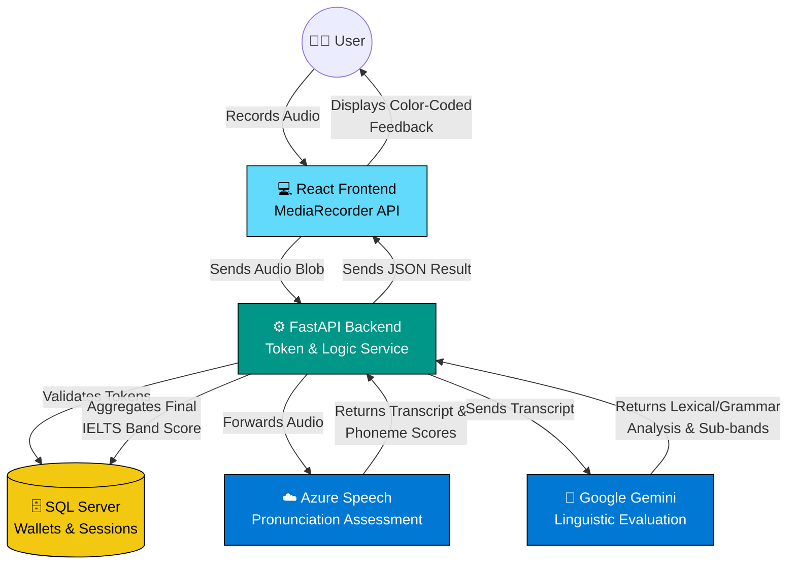
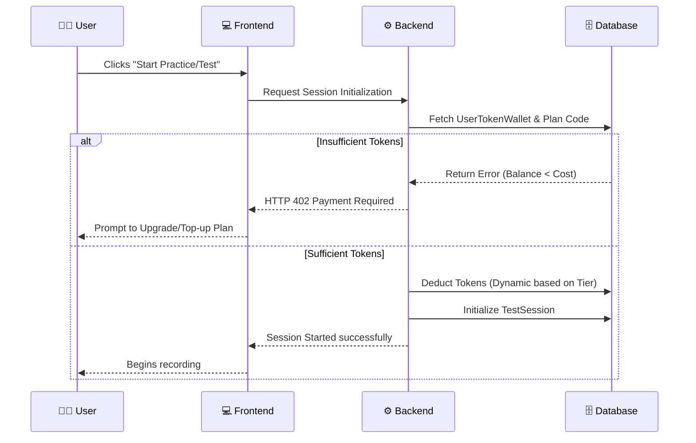

<div align="center">
  <h1>🎓 LexiLearn: Advanced IELTS Speaking System</h1>
  <p><strong>A premium, AI-powered IELTS Speaking assessment and practice platform.</strong></p>

  <p>
    
    
    
    
    
  </p>
</div>

---

## 📖 Introduction

**LexiLearn Speaking System** is an enterprise-grade EdTech platform designed to simulate the real IELTS Speaking Test environment. By combining cutting-edge **Speech Recognition (STT)**, **Pronunciation Assessment**, and **Large Language Models (LLMs)**, the system provides instantaneous, highly accurate feedback mapped directly to the official IELTS Band descriptors.

Whether users are casually practicing a specific topic or engaging in a full, time-pressured Mock Exam, the system evaluates them across the 4 key criteria: **Fluency & Coherence, Lexical Resource, Grammatical Range & Accuracy, and Pronunciation**.

## ⚙️ How It Works (System Architecture)

The system operates through a sophisticated, multi-stage pipeline:

### 🏛️ High-Level Architecture Flow



### 🧠 The Assessment Pipeline

1. **Audio Acquisition:** The React frontend captures user audio via the native `MediaRecorder` API, providing visual feedback of voice activity.
2. **Pronunciation Processing:** The raw audio is streamed/sent to the backend, which proxies it to **Azure Speech Services**. Azure performs deep phoneme-level analysis, returning granular scores for:
   - *Accuracy* (Correct phoneme pronunciation)
   - *Fluency* (Speech rate and pauses)
   - *Prosody* (Intonation and stress)
   - *Completeness* (Omitted words)
3. **Linguistic Evaluation:** The generated text transcript is forwarded to an LLM (Google Gemini / GPT-4o / DeepSeek). The AI acts as a certified IELTS examiner, analyzing the transcript for:
   - Idiomatic language and high-level vocabulary (C1/C2 words).
   - Complex grammatical structures vs. repeated simple sentences.
   - Grammatical errors (and provides corrected suggestions).
4. **Scoring & Aggregation:** The backend aggregates Azure's acoustic metrics and the LLM's linguistic metrics. Using a specialized mathematical algorithm, it calculates the sub-scores and the **Overall IELTS Band** (rounded to the nearest 0.5).
5. **Token Economy:** The transaction is logged, and tokens are deducted from the user's `UserTokenWallet` based on their active subscription tier.

### 💰 Token Economy & Subscription Logic




## ✨ Core Features

### 🎙️ Student Capabilities
* **Interactive Mock Exams:** Full simulations covering Part 1, Part 2 (Cue Card with 1-min prep), and Part 3.
* **Targeted Practice:** Browse hundreds of topics and practice specific questions at will.
* **Color-Coded Feedback:** Word-by-word visual feedback. Green for great pronunciation, Red for mispronunciations, and highlights for advanced vocabulary.
* **Token Wallet System:** A dynamic credit system where practices and tests cost tokens. Users can upgrade plans or claim daily guest rewards.
* **Guest Trials:** Device-fingerprint-based tracking allows new users to try the system without creating an account.

### 🛡️ Administrative Control
* **Dashboard Overview:** Real-time metrics on user growth, active sessions, and revenue.
* **Dynamic Subscription Plans:** Manage plan pricing (Free, Basic, Plus) and token consumption rates directly from the UI without touching code.
* **User Management:** Inspect user test histories, grant/revoke tokens manually, and suspend abusive accounts.
* **Question Bank Management:** Add, edit, or categorize IELTS questions and topics.

## 🏗️ Technology Stack

**Frontend Architecture:**
* **React 19 & TypeScript:** Strongly typed, modern UI.
* **Vite:** Blazing fast build tooling.
* **Tailwind CSS & Framer Motion:** Responsive, glass-morphism designs with fluid micro-animations.
* **Zustand / Context API:** Global state management for authentication and wallets.

**Backend Architecture:**
* **FastAPI (Python):** High-performance asynchronous API handling.
* **SQLAlchemy & PyODBC:** ORM layer connecting to an **Azure SQL Server** database.
* **JWT Authentication:** Secure, stateless session management with Google OAuth integration.

**AI & External Services:**
* **Azure Cognitive Services:** Pronunciation Assessment API.
* **Google Generative AI (Gemini):** Advanced semantic analysis and grammar correction.
* **Deepgram:** (Optional) Ultra-fast streaming transcription.
* **Azure Blob Storage:** Persistent storage for user audio records.

## 🚀 Getting Started

### 1. Prerequisites
* Python 3.11+
* Node.js 18+
* An active **SQL Server** instance (e.g., Azure SQL).
* API Keys for **Azure Speech** and **Google Gemini**.

### 2. Backend Setup
```bash
# Navigate to backend
cd backend

# Create and activate virtual environment
python -m venv venv
source venv/bin/activate  # On Windows: venv\Scripts\activate

# Install dependencies
pip install -r requirements.txt

# Configure environment
cp .env.example .env
# --> Edit .env to add your SQL Server connection string and API keys

# Run database migrations
python migrate_db.py

# Start the server
python main.py
# Server will start on http://localhost:8000
```

### 3. Frontend Setup
```bash
# Navigate to frontend
cd frontend

# Install packages
npm install

# Configure environment
cp .env.example .env
# --> Ensure VITE_API_URL points to your backend (http://localhost:8000/api/v1)

# Start development server
npm run dev
# App will be accessible at http://localhost:5173
```

## 🗄️ Database Schema Snapshot
The system relies on a tightly integrated relational schema:
* `users`: OAuth integration and core profile.
* `user_token_wallets`: Tracks balance, plan tiers, and billing cycles.
* `practice_sessions` & `practice_answers`: Granular tracking of casual practice attempts.
* `test_sessions` & `test_answers`: Official mock test attempts linking back to `exam_sets`.
* `billing_plans`: Dynamic pricing configurations managed by admins.

## 📜 License
This project is proprietary and confidential. Unauthorized copying, distribution, or modification is strictly prohibited.

---
*Built with ❤️ to empower language learners worldwide.*
