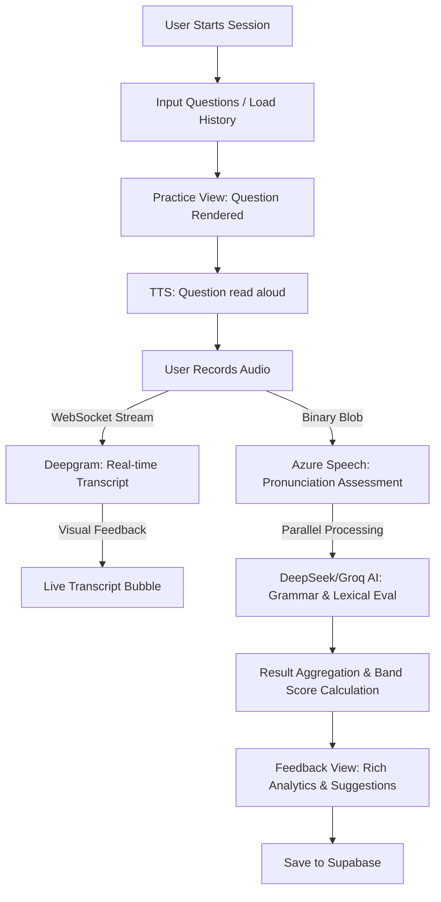

# 🎙️ Speaking Mode: Comprehensive Manifest

This document serves as the **Single Source of Truth (SSOT)** for the IELTS Speaking Practice feature in LexiLearn. It contains the complete architectural flow, design system, and source code info.

---

## 1. 🏗️ Architecture & Data Flow

### 1.1 Diagram


### 1.2 Logic Stages
1.  **Stage 0: Live Perception**: Uses Deepgram `nova-3` for real-time transcription with `filler_words` enabled to detect hesitations.
2.  **Stage 1: Technical Grading (DSP)**: Azure Speech API analyzes the audio waves against the transcript to grade Phonemes, Prosody (rhythm), and Completeness.
3.  **Stage 2: Semantic Grading (NLP)**: DeepSeek/Llama models analyze syntax, collocations, and signposting phrases against the IELTS AREA (Answer, Reason, Example, Alternative) framework.
4.  **Stage 3: Reconciliation**: Scores are mapped from 0-100 technical points to 0-9.0 IELTS bands using a non-linear normalization algorithm.

---

## 2. 🎨 UI/UX Design System

| Element | Specification |
| :--- | :--- |
| **Aesthetics** | Modern Glassmorphism, high blur (20px), subtle gradients. |
| **Colors** | Primary: Orange-Red (`#f97316`, `#ef4444`). Accents: Blue (Part 1), Orange (Part 2), Purple (Part 3). |
| **Typography** | Inter / System UI. 800-900 weight for headings. Mono for keyboard hints. |
| **Micro-interact** | Pulse rings for recording, wave animations for processing, smooth card transitions. |

---

## 3. 📄 Core Implementation (Source Code References)

### 3.1 Main Component: `src/pages/speaking/Practice.js`
This file contains the UI, State Machine, and Local Orchestration.

```javascript
import { escapeHtml } from '../../utils/helpers.js';
import { speakingService } from '../../services/speaking.service.js';
import { showToast } from '../../components/Toast.js';
import { getCurrentUser, supabaseFetch, supabaseSave } from '../../utils/supabase.js';
import { renderIcon } from '../../utils/icons.js';
import { renderWordHighlights } from '../../services/azure-speech.service.js';
import { SPEAKING_PHRASES } from '../../data/speaking_phrases.js';

export async function renderSpeakingPractice(container, opts = {}) {
  if (typeof container === 'string') container = document.querySelector(container);
  if (!container) return;

  const onBack = opts.onBack || null;

  // ─── STATE MANAGEMENT ─────────────────────────────────────────────
  const state = {
    view: 'input', 
    sessionTitle: 'Speaking Practice ' + new Date().toLocaleDateString('en-GB'),
    questions: [],
    activeIndex: 0,
    currentSessionId: null,
    pastSessions: [],
    recordState: 'idle', 
    liveTranscript: '',
    interimTranscript: '',
    recordedBlob: null,
    stream: null,
    recognition: null,
    socket: null,
    socketActive: false,
    sessionsLoaded: false,
    expandedSidebarIdx: null,
    isFallback: false,
    keyHandler: null
  };

  // --- Core logic functions (initSpeechRecognition, startRecording, etc.) ---
  // [Implementation as seen in Practice.js]
  // ...
  render();
}
```

### 3.2 Service Layer: `src/services/speaking.service.js`
Handles API communication, Database interactions, and AI logic coordination.

```javascript
import { supabaseFetch, supabaseSave } from '../core/db.js';
import { getEmbedding, cosineSimilarity } from '../utils/embedding.util.js';
import * as aiGateway from './ai-gateway.service.js';
import { SPEAKING_PHRASES } from '../data/speaking_phrases.js';
import { assessPronunciation } from './azure-speech.service.js';

export const speakingService = {
  async evaluateWithAzure(questionText, transcript, audioBlob, part = 1) {
    const [azureResult, deepseekResult] = await Promise.allSettled([
      assessPronunciation(audioBlob, transcript),
      this.evaluateLexicalGrammar(questionText, transcript, part)
    ]);
    // Processing results...
    return {
       // Combined band and feedback structure
    };
  }
  // ... other methods ...
};
```

---

## 4. 🗄️ Database & Environment Key Mapping

### 4.1 Supabase Schema
-   **Table: `speaking_sessions`**: `id`, `user_id`, `title`, `created_at`.
-   **Table: `speaking_questions`**: `id`, `session_id`, `question_text`, `part`, `order_index`.
-   **Table: `speaking_answers`**: `question_id`, `user_id`, `feedback_json`, `overall_band`, `student_transcript`.

### 4.2 API Dependencies
-   **Azure Speech**: `Region`, `SubscriptionKey`.
-   **Deepgram**: `VITE_DEEPGRAM_API_KEY`.
-   **AI Gateway**: `DeepSeek-chat`, `Groq-Llama-3.3`.

---

## 5. 🛠️ How to Deploy/Replicate
1.  **Deploy `Practice.js`** to your project's pages directory.
2.  **Verify Services**: Ensure `speaking.service.js` and `azure-speech.service.js` are correctly configured.
3.  **Supabase Tables**: Run migrations for `sessions`, `questions`, and `answers`.
4.  **ENV Setup**: Configure Deepgram and Azure keys in your environment.
5.  **Router Integration**: Point your `/speaking/practice` route to the `renderSpeakingPractice` function.

---
*Generated by Antigravity AI for LexiLearn Project.*
