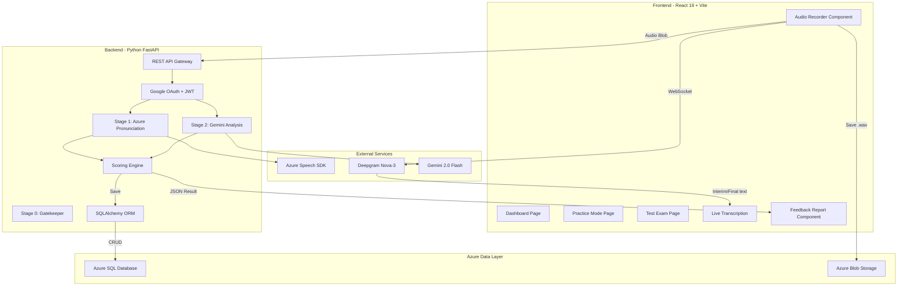
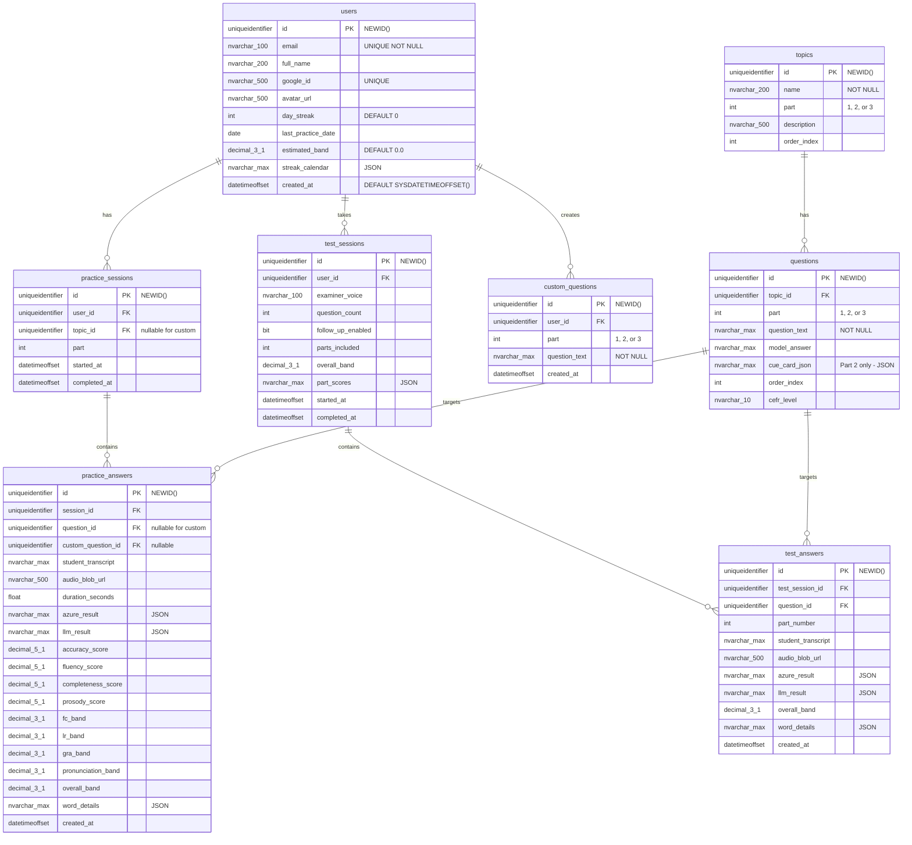

# System Design & Architecture

## Architecture Overview



### Key Components
| Component | Responsibility | Technology |
|-----------|---------------|------------|
| **Frontend** | UI rendering, audio capture, real-time visualization | React 19, Vite, TailwindCSS, Recharts |
| **Backend API** | Audio processing, orchestration of AI pipeline | Python FastAPI, asyncio |
| **Auth** | Google OAuth login, JWT session management | `authlib`, `python-jose` |
| **Gatekeeper** | Stage 0: Relevance/off-topic check before expensive AI calls | Gemini embeddings + cosine similarity |
| **Azure Speech** | Pronunciation assessment (4 factors) | Azure SDK `azure-cognitiveservices-speech` |
| **Deepgram** | Real-time live transcription | Deepgram Nova-3 WebSocket |
| **LLM Service** | Linguistic analysis (FC, LR, GRA) + "Explain more" | Gemini 2.0 Flash |
| **Scoring Engine** | IELTS Band score calculation | Custom Python logic |
| **Database** | All relational data (users, questions, sessions, scores) | Azure SQL via SQLAlchemy + pyodbc |
| **Blob Storage** | Audio file persistence for replay | Azure Blob Storage |

---

## Data Models

### Core Database Schema (Azure SQL / SQL Server)



### SQL Server Type Mapping
| Concept | SQL Server Type | Notes |
|---------|----------------|-------|
| UUID PK | `UNIQUEIDENTIFIER DEFAULT NEWID()` | Compatible with frontend `crypto.randomUUID()` |
| JSON data | `NVARCHAR(MAX)` | With `ISJSON()` check constraint |
| Boolean | `BIT` | 0/1 |
| Timestamp | `DATETIMEOFFSET` | Timezone-aware |
| Text | `NVARCHAR(MAX)` | Unicode support |
| Short text | `NVARCHAR(n)` | Length-bounded |
| Score 0-100 | `DECIMAL(5,1)` | One decimal place |
| Band 0-9 | `DECIMAL(3,1)` | One decimal place |

### Key JSON Structures

#### `azure_result` (from Azure Speech SDK)
```json
{
  "accuracy_score": 88.5,
  "fluency_score": 82.0,
  "completeness_score": 95.0,
  "prosody_score": 79.5,
  "pronunciation_score": 83.3,
  "words": [
    {
      "word": "honestly",
      "accuracy_score": 92.3,
      "error_type": "None",
      "phonemes": [
        { "phoneme": "ɑ", "accuracy_score": 95.0, "error_type": "None" },
        { "phoneme": "n", "accuracy_score": 88.0, "error_type": "None" }
      ]
    }
  ]
}
```

#### `llm_result` (from Gemini)
```json
{
  "FC": {
    "score": 7.0,
    "feedback": "Bạn sử dụng tốt các từ nối... (Vietnamese feedback)",
    "key_findings": ["Dùng 'Moreover' tự nhiên", "Cần thêm discourse markers"]
  },
  "LR": {
    "score": 6.5,
    "feedback": "Từ vựng khá đa dạng nhưng... (Vietnamese feedback)",
    "band_8_plus_words": ["consequently", "indispensable"]
  },
  "GRA": {
    "score": 7.0,
    "feedback": "Sử dụng câu phức tốt... (Vietnamese feedback)",
    "error_types": ["subject-verb agreement"],
    "complexity": "Advanced"
  },
  "model_answer": "To be honest, I genuinely enjoy my studies..."
}
```

> **Key mapping:** `FC` = Fluency & Coherence, `LR` = Lexical Resource, `GRA` = Grammatical Range & Accuracy. These abbreviated keys match the `BandScores` Pydantic model aliases and frontend `ReasoningCards` component.

#### `word_details` (merged for UI rendering)
```json
[
  {
    "word": "honestly",
    "accuracy_score": 92.3,
    "color": "green",
    "error_type": "None",
    "phonemes": [...]
  },
  {
    "word": "studees",
    "accuracy_score": 45.0,
    "color": "red",
    "error_type": "Mispronunciation",
    "expected": "studies",
    "phonemes": [
      { "phoneme": "ʌ", "expected": "ʌ", "accuracy": 90 },
      { "phoneme": "iː", "expected": "ɪz", "accuracy": 30, "error_type": "Mispronunciation" }
    ]
  }
]
```

#### `cue_card_json` (Part 2 questions only)
```json
{
  "topic": "Describe a book you enjoyed reading",
  "points": [
    "What the book is about",
    "When you read it",
    "Why you enjoyed it"
  ],
  "follow_up": "And explain what you learned from it"
}
```

---

## API Design

### Backend Endpoints

| Endpoint | Method | Purpose | Auth |
|----------|--------|---------|------|
| `POST /api/v1/auth/google` | POST | Google OAuth login → JWT | Public |
| `GET /api/v1/auth/me` | GET | Get current user profile | JWT |
| `POST /api/v1/speech/assess` | POST | Main: Audio + question → full assessment | JWT |
| `POST /api/v1/speech/explain-more` | POST | Deeper AI analysis for one criterion | JWT |
| `GET /api/v1/topics` | GET | Fetch topic list with question counts | JWT |
| `GET /api/v1/topics/{id}/questions` | GET | Fetch all questions for a topic | JWT |
| `GET /api/v1/questions?part={1,2,3}` | GET | Fetch questions by part | JWT |
| `POST /api/v1/questions/custom` | POST | Add a custom user question | JWT |
| `GET /api/v1/questions/custom` | GET | List user's custom questions | JWT |
| `GET /api/v1/user/dashboard` | GET | Streak, heatmap, band estimate, forecast | JWT |
| `GET /api/v1/user/history` | GET | Practice history with pagination | JWT |
| `POST /api/v1/test/start` | POST | Start a test session | JWT |
| `POST /api/v1/test/{id}/answer` | POST | Submit a test answer | JWT |
| `POST /api/v1/test/{id}/complete` | POST | Complete test → generate report | JWT |
| `GET /api/v1/test/{id}/report` | GET | Fetch test report | JWT |
| `GET /health` | GET | Health check | Public |

### Main Assessment Request
```
POST /api/v1/speech/assess
Content-Type: multipart/form-data
Authorization: Bearer <jwt_token>

Fields:
  - audio: File (WAV/WebM)
  - question_id: UUID (nullable for custom)
  - custom_question_id: UUID (nullable)
  - question_text: string
  - mode: "practice" | "test"
```

### Main Assessment Response
```json
{
  "question_id": "question-uuid",
  "user_id": "google-sub-id",
  "timestamp": "2026-04-04T09:00:00Z",
  "student_transcript": "Honestly, I really like my studies...",
  "is_relevant": true,
  "relevance_score": 95,
  "audio_url": "user-id/answer-id.wav",
  "overall_band": 7.0,
  "band_scores": {
    "FC": 7.0,
    "LR": 6.5,
    "GRA": 7.0,
    "PRON": 7.5
  },
  "azure_pronunciation": {
    "accuracy_score": 88.5,
    "fluency_score": 82.0,
    "completeness_score": 95.0,
    "prosody_score": 79.5
  },
  "feedback_json": {
    "FC": { "score": 7.0, "feedback": "Vietnamese feedback...", "key_findings": ["...", "..."] },
    "LR": { "score": 6.5, "feedback": "Vietnamese feedback...", "band_8_plus_words": ["consequently", "indispensable"] },
    "GRA": { "score": 7.0, "feedback": "Vietnamese feedback...", "error_types": ["subject-verb agreement"], "complexity": "Advanced" },
    "model_answer": "A high-scoring (Band 8.5+) version of this answer..."
  },
  "color_coded_transcript": [
    { "word": "honestly", "color": "green", "accuracy_score": 92.0, "error_type": null, "phonemes": [...] },
    { "word": "studies", "color": "amber", "accuracy_score": 72.0, "error_type": "Mispronunciation", "phonemes": [...] }
  ]
}
```

> **Note:** `band_scores` uses abbreviated keys (`FC`, `LR`, `GRA`, `PRON`) as aliases for `fluency_coherence`, `lexical_resource`, `grammatical_accuracy`, `pronunciation`. The Pydantic model supports both via `populate_by_name = True`.

### Explain More Request/Response
```
POST /api/v1/speech/explain-more
{
  "answer_id": "uuid",
  "criterion": "fluency_coherence" | "lexical_resource" | "grammatical_accuracy" | "pronunciation",
  "original_reasoning": "...",
  "transcript": "..."
}

Response:
{
  "detailed_explanation": "Chi tiết hơn: Bạn đã sử dụng...",
  "examples": ["Do: ...", "Don't: ..."],
  "suggested_phrases": ["However, ...", "Moreover, ..."]
}
```

---

## Component Breakdown

### Frontend Components

#### Page Components
1. **DashboardPage** — Main landing page
   - `StreakCounter` — Day streak with animated counter
   - `DailyMission` — "Ghi âm 25 câu trả lời nhé :)"
   - `ContributionHeatmap` — GitHub-style calendar (5 months)
   - `BandEstimate` — Current estimated band with tips card
   - `FeatureCards` — Quick nav to Practice (Part 1/2/3) and Test Exam
   - `ForecastProgress` — Progress bars per Part (e.g., 1/166)

2. **PracticeModePage** — Topic-based practice (Unscripted mode)
   - `PartNavigation` — Tab bar for Part 1/2/3/Custom
   - `TopicSidebar` — Scrollable topic list with active highlight
   - `QuestionGrid` — 2-column card grid for questions per topic
   - `AddQuestionModal` — Form to add custom questions ("Câu Bạn thêm")
   - `RecordingModal` — Modal with mic button, waveform, live transcript
   - `FeedbackPanel` — Detailed results after recording
   - `PracticeHistory` — List of past answers with band badges

3. **TestExamPage** — Simulated IELTS test
   - `TestSetupModal` — Examiner voice, question count, follow-up toggle
   - `TestRunner` — Sequential question flow
     - Part 1/3: Standard question + record
     - Part 2: Cue card → 1min prep timer → 1-2min speaking timer
   - `TestReport` — Comprehensive multi-question report

#### Shared Components
- `AudioRecorder` — MediaRecorder API wrapper with waveform viz
- `AudioPlayer` — Playback component for recorded audio (from Blob URL)
- `LiveTranscript` — Real-time text display (interim gray, final black)
- `BandBadge` — Color-coded band score display
- `WordChips` — Color-coded word display (green ≥80 / amber ≥60 / red <60)
- `PhonemeDetail` — Popup showing phoneme-level IPA error info
- `AzureDashboard` — 4-bar horizontal chart for Accuracy/Fluency/Completeness/Prosody
- `ReasoningCard` — AI feedback card with expandable details + "Explain more" button
- `ModelAnswer` — Styled model answer display (italic, gradient bg)
- `Sidebar` — Navigation sidebar (Dashboard/Practice/Test)
- `CueCard` — Part 2 topic card with bullet points

### Backend Services

1. **AuthRouter** (`routes/auth.py`) — Google OAuth + JWT
2. **SpeechRouter** (`routes/speech.py`) — Assessment + explain-more endpoints
3. **QuestionsRouter** (`routes/questions.py`) — Topics, questions, custom questions CRUD
4. **TestRouter** (`routes/test.py`) — Test session lifecycle
5. **UserRouter** (`routes/user.py`) — Dashboard data, history
6. **AudioPreprocessor** (`services/audio_preprocessor.py`) — Resample to 16kHz WAV
7. **DeepgramService** (`services/deepgram_service.py`) — STT transcription
8. **AzureService** (`services/azure_service.py`) — Pronunciation assessment
9. **LLMService** (`services/llm_service.py`) — Gemini linguistic analysis + explain-more
10. **ScoringService** (`services/scoring_service.py`) — Band calculation + IELTS rounding
11. **BlobService** (`services/blob_service.py`) — Azure Blob Storage upload/download
12. **DatabaseService** (`services/database.py`) — SQLAlchemy session management

---

## Design Decisions

### 1. Azure Speech as Primary Pronunciation Engine
**Decision:** Use Azure Speech SDK Pronunciation Assessment exclusively for pronunciation scoring.
**Rationale:** Only service providing built-in Accuracy, Fluency, Completeness, Prosody + phoneme-level detail.
**Tradeoff:** Higher latency (~2-3s) vs Deepgram (~300ms), but pronunciation accuracy is the priority.

### 2. Deepgram for Live Transcription Only
**Decision:** Use Deepgram Nova-3 for real-time transcription during recording, not for scoring.
**Rationale:** Sub-300ms latency ideal for live UX feedback. Cost minimized by streaming only during active recording.

### 3. Azure SQL Database (SQL Server)
**Decision:** Use Azure SQL as the sole relational database.
**Rationale:** User requirement. SQL Server provides enterprise-grade reliability. SQLAlchemy 2.0 ORM abstracts SQL Server-specific syntax. Replaces Supabase PostgreSQL entirely.
**JSON handling:** Store as `NVARCHAR(MAX)` with `ISJSON()` constraints; parse at application layer via Pydantic.

### 4. Google OAuth via FastAPI
**Decision:** Implement Google OAuth on the backend with JWT session tokens.
**Rationale:** Replaces Supabase Auth. Single sign-on simplicity for users. `authlib` library handles OAuth flow. JWT tokens stored in `localStorage` on frontend.
**Security:** All protected endpoints require `Authorization: Bearer <token>` header.

### 5. Azure Blob Storage for Audio
**Decision:** Store audio recordings in Azure Blob Storage with user-scoped paths.
**Rationale:** Replaces Supabase Storage. Scalable, pairs with other Azure services. Signed URLs for secure access. Path format: `audio/{user_id}/{answer_id}.wav`.

### 6. Backend-Side Azure Processing
**Decision:** Send audio to backend, which calls Azure (not direct browser→Azure).
**Rationale:** Keeps API keys secure, enables parallel Azure + LLM pipeline, allows audio preprocessing.

### 7. IELTS-Aligned Scoring Formula
```
Pronunciation Band = map_to_ielts(0.6 × Accuracy + 0.2 × Fluency + 0.2 × Prosody)
Overall Band = round_ielts((FC + LR + GRA + Pronunciation) / 4)
IELTS Rounding: ≥0.75 → round up, 0.25-0.74 → .5, <0.25 → round down
```

### 8. Simplified "Explain More" Instead of Full Chat
**Decision:** One-shot "Explain more" per reasoning card instead of a full conversational AI.
**Rationale:** Prevents scope creep. Sends the original reasoning + transcript to Gemini with a deeper-analysis prompt. Returns Vietnamese explanation with examples and suggestions.

---

## Non-Functional Requirements

### Performance
- Audio upload + full assessment pipeline: **< 8 seconds**
- Live transcription display: **< 500ms latency**
- Frontend initial load: **< 3 seconds** on 4G
- Dashboard data fetch: **< 1 second**

### Scalability
- Support 100 concurrent users initially
- Azure SQL handles connection pooling natively
- Stateless FastAPI backend can scale horizontally

### Security
- Azure API keys stored server-side only (never exposed to frontend)
- Google OAuth for user authentication
- Application-level user data isolation via `user_id` filtering in all queries
- Audio files stored with signed URLs (time-limited access)
- JWT tokens with 24-hour expiry

### Reliability
- Graceful degradation: mock scores if Azure is down
- Error boundaries in React for component-level failure isolation
- Request retry with exponential backoff for transient API failures
