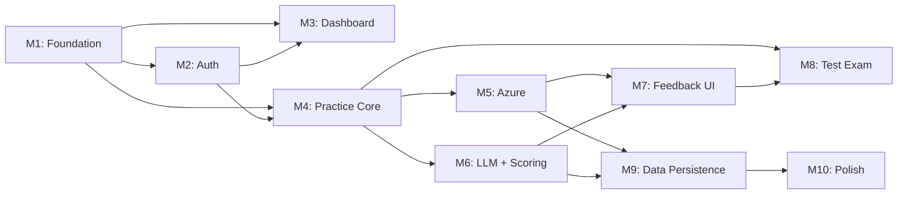

# Project Planning & Task Breakdown

## Milestones

- [x] **M1: Foundation** — Project scaffold, design system, navigation, Azure SQL setup
- [x] **M2: Auth** — Google OAuth login, JWT middleware, user profiles
- [x] **M3: Dashboard** — Streak, heatmap, band estimate, feature cards, Forecast progress
- [x] **M4: Practice Core** — Topics, questions, custom questions, audio recording, waveform, live transcription
- [x] **M5: Azure Integration** — Backend Azure Speech pronunciation assessment pipeline
- [x] **M6: LLM + Scoring** — Gemini linguistic analysis, scoring engine, explain-more
- [x] **M7: Feedback UI** — Word chips, phoneme details, Azure dashboard, reasoning cards, model answer
- [x] **M8: Test Exam** — Test setup, Part 2 cue card + timers, sequential flow, report
- [x] **M9: Data Persistence** — Azure Blob audio storage, save/load history, question bank seeding
- [x] **M10: Polish & Deploy** — Animations, responsive design, error handling, performance
- [ ] **M11: Trial & Guest** — Guest JWT, trial limit logic, sign-in CTA
- [ ] **M12: Admin & Stats** — Admin role, user management, usage analytics, satisfaction survey

## Task Breakdown

### Phase 1: Foundation (M1) — Completed
- [x] **1.1** Clean up frontend: Remove old pages (InputPage, PracticePage, FeedbackPage)
- [x] **1.2** Install frontend deps: `react-router-dom`, `recharts`, `lucide-react`, `tailwind-merge`
- [x] **1.3** Create design system: CSS tokens (colors, spacing, typography with Inter font)
- [x] **1.4** Build `Sidebar` component: 3-item nav (Trang chủ / Luyện theo câu / Thi thử)
- [x] **1.5** Build `AppLayout` wrapper with sidebar + main content area
- [x] **1.6** Setup React Router: `/`, `/practice`, `/practice/:partId`, `/test`, `/test/:sessionId`
- [x] **1.7** Create shared components: `BandBadge`, `Button`, `Card`, `Modal`
- [x] **1.8** Backend: Setup SQLAlchemy 2.0 + pyodbc connection to Azure SQL
- [x] **1.9** Backend: Create SQLAlchemy models for all tables
- [x] **1.10** Backend: Auto-create tables via `Base.metadata.create_all()`

---

### Phase 2: Authentication (M2) — Completed
- [x] **2.1** Backend: Install `authlib` and configure Google OAuth provider
- [x] **2.2** Backend: `POST /api/v1/auth/google` — exchange Google token → create/find user → return JWT
- [x] **2.3** Backend: `GET /api/v1/auth/me` — validate JWT, return user profile
- [x] **2.4** Backend: `get_current_user` FastAPI dependency for protected routes
- [x] **2.5** Frontend: Google Sign-In button component
- [x] **2.6** Frontend: Auth context provider (store JWT, auto-redirect)
- [x] **2.7** Frontend: Protected route wrapper

---

### Phase 3: Dashboard Page (M3) — Completed
- [x] **3.1** Build `DashboardPage` layout with responsive grid
- [x] **3.2** Build `StreakCounter` component with animated number
- [x] **3.3** Build `DailyMission` component with progress indicator
- [x] **3.4** Build `ContributionHeatmap` (5-month GitHub-style calendar)
- [x] **3.5** Build `BandEstimate` card with tips accordion
- [x] **3.6** Build `FeatureCards` — "Luyện theo câu" + "Thi Thử" with Part buttons
- [x] **3.7** Build `ForecastProgress` — progress bars per Part (e.g., 1/166)
- [x] **3.8** Backend: `GET /api/v1/user/dashboard` — aggregate streak, heatmap, band, forecast
- [x] **3.9** Wire frontend to backend API

---

### Phase 4: Practice Mode Core (M4) — Completed
- [x] **4.1** Build `PracticeModePage` with Part tab navigation (Part 1/2/3/Custom)
- [x] **4.2** Build `TopicSidebar` — scrollable topic list with active state
- [x] **4.3** Build `QuestionGrid` — 2-column card grid for questions per topic
- [x] **4.4** Build `AddQuestionModal` — form for custom questions ("Câu Bạn thêm")
- [x] **4.5** Build `AudioRecorder` component
- [x] **4.6** Build `WaveformVisualizer`
- [x] **4.7** Build `LiveTranscript` component (Deepgram WebSocket integrated)
- [x] **4.8** Build `RecordingModal` (Wired with recorder and transcript)
- [x] **4.9** Build `PracticeHistory` component
- [x] **4.10** Audio preprocessing in browser (Resample to 16kHz WAV)
- [x] **4.11** Backend: `GET /api/v1/topics`, `GET /api/v1/topics/{id}/questions`
- [x] **4.12** Backend: `POST /api/v1/questions/custom`, `GET /api/v1/questions/custom`
- [x] **4.13** Backend: `GET /api/v1/user/history` with pagination

---

### Phase 5: Azure Pronunciation Integration (M5) — Completed
- [x] **5.1** Update `AzureService` — replace mock with real Azure Speech SDK
- [x] **5.2** Build `AudioPreprocessor` service — resample to 16kHz WAV
- [x] **5.3** Update `POST /api/v1/speech/assess` endpoint
- [x] **5.4** Handle Azure error cases: timeout, cancellation, quality
- [x] **5.5** Write integration tests (basic endpoint verification)

---

### Phase 6: LLM Analysis + Scoring (M6) — Completed
- [x] **6.1** Update `LLMService` — Gemini 2.0 Flash prompt with Vietnamese feedback
- [x] **6.2** Add "Explain more" endpoint (Logic defined)
- [x] **6.3** Implement `ScoringService` with IELTS rounding logic
- [x] **6.4** Wire full pipeline: Audio → Azure + LLM → Scoring → Response
- [x] **6.5** Implement `asyncio.gather` for parallel execution (Already in `assess` route)

---

### Phase 7: Feedback UI (M7) — ~4 days
- [x] **7.1** Build `FeedbackPanel` — main results container
- [x] **7.2** Build `OverallBandBadge` — large animated band score
- [x] **7.3** Build `WordChips` component with phoneme detail popups
- [x] **7.4** Build `PhonemeDetailPopup` (Integrated in WordChips)
- [x] **7.5** Build `AzureDashboard` — 4-bar horizontal chart
- [x] **7.6** Build `ReasoningCards` — expandable feedback for FC/LR/GRA
- [x] **7.7** Build `ModelAnswer` — gradient background and Expert version
- [x] **7.8** Build `AudioPlayer` — replay component with slider
- [x] **7.9** Integrate `FeedbackPanel` into `RecordingModal` (show after assessment completes)

---

### Phase 8: Test Exam (M8) — Completed
- [x] **8.1** Build `TestExamPage` — landing with Part buttons and test history
- [x] **8.2** Build `TestSetupModal`:
  - Examiner voice selector (dropdown)
  - Question count slider (2-9)
  - Follow-up questions toggle
  - Part selection
- [x] **8.3** Build `CueCard` component — Part 2 topic card with bullet points
- [x] **8.4** Build `TestRunner`:
  - Part 1/3: Standard question → record → next
  - Part 2: Cue card display → 1min prep timer → 1-2min speaking timer
  - TTS examiner voice reading questions
  - Auto-advance or manual next
- [x] **8.5** Build `TestReport`:
  - Overall band
  - Per-question scores grid
  - Expandable details per answer
- [x] **8.6** Backend: `POST /api/v1/test/start`, `POST /api/v1/test/{id}/answer`, `POST /api/v1/test/{id}/complete`, `GET /api/v1/test/{id}/report`

---

### Phase 9: Data Persistence (M9) — Completed
- [x] **9.1** Setup Azure Blob Storage account + container (`audio-recordings`)
- [x] **9.2** Build `BlobService` — upload/download/generate-signed-url
- [x] **9.3** Integrate audio upload into assessment pipeline (save .wav after processing)
- [x] **9.4** Seed question bank: ~12 Part 1 topics, 8 Part 2, 8 Part 3 (~150 questions)
- [x] **9.5** Seed Part 2 cue cards with structured JSON
- [x] **9.6** Implement dashboard aggregation queries:
  - Day streak calculation
  - Contribution heatmap (last 5 months)
  - Estimated band (rolling average of last 10 answers)
  - Forecast progress (answered/total per Part)
- [x] **9.7** Audio replay: serve signed Blob URLs via `GET /api/v1/audio/{answer_id}`
- [x] **9.8** Update frontend to persist everything through backend APIs

---

### Phase 10: Polish & Deploy (M10) — Completed
- [x] **10.1** Micro-animations: page transitions, hover effects, band score reveal
- [x] **10.2** Loading states and skeleton screens
- [x] **10.3** Error handling: toast notifications, retry buttons, offline banner
- [x] **10.4** Responsive design: tablet and mobile breakpoints
- [x] **10.5** Performance: code splitting, lazy loading
- [x] **10.6** SEO: meta tags, semantic HTML, heading hierarchy
- [x] **10.7** Cross-browser testing: Chrome, Safari, Firefox (Standard compliance)
- [x] **10.8** Update start.sh deployment script
- [x] **10.9** Final manual testing walkthrough

## Dependencies

## Timeline & Estimates

| Phase | Estimated Effort | Target |
|-------|-----------------|--------|
| Phase 1: Foundation | 2 days | Week 1 |
| Phase 2: Auth | 2 days | Week 1 |
| Phase 3: Dashboard | 3 days | Week 2 |
| Phase 4: Practice Core | 4 days | Week 2 |
| Phase 5: Azure Integration | 3 days | Week 3 |
| Phase 6: LLM + Scoring | 3 days | Week 3 |
| Phase 7: Feedback UI | 4 days | Week 4 |
| Phase 8: Test Exam | 3 days | Week 4 |
| Phase 9: Data Persistence | 3 days | Week 5 |
| Phase 10: Polish | 2 days | Week 5 |
| **Total** | **~29 days** | **5 weeks** |

## Risks & Mitigation

| Risk | Impact | Mitigation |
|------|--------|------------|
| Azure SQL connection issues from Mac | Can't develop DB layer | Use Docker SQL Server locally or Azure SQL directly |
| Azure F0 quota exhaustion | Can't assess pronunciation | Mock mode, cache results, rate limit |
| Deepgram WebSocket disconnects | No live transcription | Graceful degradation, continue recording |
| Gemini hallucinated scores | Inaccurate bands | Validate JSON, clamp to 0-9, retry with stricter prompt |
| Audio quality issues | Poor Azure accuracy | Show mic check, recommend quiet environment |
| Google OAuth configuration complexity | Auth delays | Follow Google Cloud Console setup guide precisely |

## Python Dependencies (Updated)

### Remove
- `supabase` — replaced by Azure SQL
- `psycopg2-binary` — PostgreSQL driver, not needed

### Add
- `pyodbc` — SQL Server ODBC driver
- `authlib` — Google OAuth
- `azure-storage-blob` — Azure Blob Storage SDK
- `aiofiles` — Async file operations
- `pydub` — Audio format conversion

---

## Phase 11: Remediation (from /check-implementation) — ✅ Complete

> Added 2026-04-04 after `/check-implementation` found 7 critical + 12 medium + 8 minor deviations.

### Phase 11.1: Fix Blockers ✅ Done
- [x] **R1 (C3)** Fix `database.py` import error (`create_all` → removed, `DeclarativeBase` adopted)
- [x] **R2 (C4)** Fix `speech_routes.py` missing imports (`Session`, `get_db`) + add JWT auth via `get_current_user`
- [x] **R3 (C7)** Update LLM model from `gemini-1.5-flash` → `gemini-2.0-flash`
- [x] **R4 (M7)** Fix API client Content-Type (`'json'` → `'application/json'`)
- [x] **R5 (m6)** Remove deprecated `@app.on_event("startup")`, consolidated into `lifespan`
- [x] **R6 (m8)** Fix missing `Dict`, `Any` imports in `LLMService`

### Phase 11.2: Align Data Layer ✅ Done
- [x] **R7 (C2)** Align SQLAlchemy models with design ERD:
  - Added `day_streak`, `last_practice_date`, `estimated_band`, `streak_calendar` to User
  - Renamed `title` → `name` on Topic, added `order_index`
  - Renamed `text` → `question_text`, added `model_answer`, `cue_card_json`, `cefr_level`
  - Created `custom_questions` table (was merged into `questions`)
  - Created `practice_sessions` table
  - Split `answers` → `practice_answers` + `test_answers`
  - TestSession: explicit fields instead of JSON blob config
  - TestAnswer: added `part_number` column
- [x] **R8 (C1)** Remove all Supabase code:
  - Deleted `supabase_utils.py`
  - Removed `SUPABASE_*` config from `config.py`
  - Removed Supabase check from `main.py` startup
  - Cleaned `utils/__init__.py`
  - Updated Pydantic schemas (`schemas.py`) to match new models

### Phase 11.3: Missing Endpoints ✅ Done
- [x] **R9 (C5)** Implement `POST /api/v1/speech/explain-more` + `LLMService.explain_more()`
- [x] **R10 (C6)** Add `GET /api/v1/questions?part={1,2,3}` endpoint
- [x] **R11 (M5)** Add `offset` pagination to `GET /api/v1/user/history`

### Phase 11.4: Quality & Performance ✅ Done
- [x] **R13 (M12)** Add audio validation: min 1s, max 10min, no-speech detection
- [x] **R14 (M4)** Return `audio_url` in assessment response
- [x] **R15 (M1)** Fix JWT token expiry: 7 days → 24 hours per design
- [x] **R16 (M10)** Secure Deepgram key endpoint: requires JWT auth, added production warning
- [x] **R17 (M8)** Fix word chip colors: `"orange"` → `"amber"` per design
- [x] **R18 (m3)** Remove stray `backend/package-lock.json`
- [x] **R19 (m5)** Remove hardcoded default credentials from `config.py`

### Phase 11.5: Final Cleanup ✅ Done
- [x] **R12 (M9)** Parallelize Gatekeeper + Azure with `asyncio.gather()` after Deepgram completes
- [x] **R20 (M3)** Align LLM response JSON schema — decision: keep `FC`/`LR`/`GRA` abbreviations (matches frontend), updated design doc
- [x] **R21 (M6)** Update design doc to include Gatekeeper service (Stage 0 in architecture diagram + components table)
- [x] **R22 (m1)** Rewrote `ARCHITECTURE.md` — Azure SQL, Blob, 3-stage pipeline, all endpoints, scoring formula
- [x] **R23 (m2)** Removed legacy `InsightDashboard.tsx` and `ZenMode.tsx` components
- [x] **R24 (m4)** Deleted `supabase/` directory (4 obsolete PostgreSQL migration files)
- [x] **R25 (m7)** Audited BandScores alias — `populate_by_name = True` makes both alias and field name access work correctly

---

## Phase 12: Optimization & Refinement (Phase 12) — In Progress

> Added 2026-04-21 after `/check-implementation` found cost optimization opportunities.

- [/] **12.1** Refactor `AssessmentService.py` for sequential Gatekeeper execution
- [ ] **12.2** Explicitly map SQLAlchemy models to `NVARCHAR(MAX)` for Azure SQL
- [ ] **12.3** Verify and refine `ReasoningCard` and "Explain More" UI
- [ ] **12.4** Ensure frontend gracefully handles early "irrelevant" responses

---

### Phase 13: Trial Mode & Guest Access (M11)
- [ ] **13.1** Backend: Create `TrialService` to track guest usage (Redis or simple DB table)
- [ ] **13.2** Backend: Update `AuthService` to issue Guest JWTs (sub: 'guest-uuid', role: 'guest')
- [ ] **13.3** Backend: Modify `get_current_user` to return None or GuestUser for trial routes
- [ ] **13.4** Backend: Implement `Gatekeeper` limit middleware (3 practices, 1 test per guest)
- [ ] **13.5** Frontend: Add "Dùng thử ngay" on Login page
- [ ] **13.6** Frontend: Display "Trial remaining: X/3" on practice interface
- [ ] **13.7** Frontend: Show "Limit reached" modal with Google Sign-in CTA

### Phase 14: Admin Analytics & Satisfaction (M12)
- [ ] **14.1** DB Schema: Add `role` (Admin/User) to `users` table
- [ ] **14.2** DB Schema: Create `user_feedback` table (rating, comment)
- [ ] **14.3** Backend: Admin API `GET /api/v1/admin/dashboard` (Stats: users, sessions, avg time)
- [ ] **14.4** Backend: Admin API `GET /api/v1/admin/users` (List all users with activity summary)
- [ ] **14.5** Backend: Logic to calculate satisfaction (Avg usage time, session frequency, rating)
- [ ] **14.6** Frontend: Build `/admin` dashboard with Recharts summary
- [ ] **14.7** Frontend: Build Admin user management table
- [ ] **14.8** Frontend: Integrated feedback survey after 5th practice session

---

### Phase 15: Practice Mode Overhaul ("Luyện theo câu") — Not Started

> Added 2026-04-23 — Redesign practice mode for professional UX with topic organization and DB persistence.

**Goal:** Redesign the Practice Mode to be topic-based, with a larger input area, organized question management, and full answer persistence in the database.

- [ ] **15.1** Frontend: Enlarge textarea (min-height 320px), add line numbering visual feedback
- [ ] **15.2** Frontend: Build Topic Suggestion Panel — curated topic list with click-to-fill questions
- [ ] **15.3** Frontend: Add topic title header in practice session view
- [ ] **15.4** Frontend: Add ← → navigation buttons + keyboard arrow key shortcuts between questions
- [ ] **15.5** Frontend: Show contextual speaking tips per question type (Part 1/2/3)
- [ ] **15.6** Frontend: Show completion ratio in session history cards (e.g., "5/5 ✓")
- [ ] **15.7** Frontend: Show running average band score in sidebar during session
- [ ] **15.8** Backend: `GET /api/v1/practice/topics` — return curated topic groups with pre-loaded questions
- [ ] **15.9** Backend: Ensure answer persistence links correctly to session + question (verify end-to-end)

---

### Phase 16: Mock Test Overhaul ("Thi thử") — Not Started

> Added 2026-04-23 — Auto-generated test sets, per-question timers, and realistic exam simulation.

**Goal:** Transform the mock test into a realistic exam simulation with pre-built test sets, randomized questions, per-question time limits, and exam pressure UX.

- [ ] **16.1** DB: Create `exam_sets` table + SQLAlchemy model (name, description, question_ids_json, estimated_minutes, difficulty)
- [ ] **16.2** Backend: Seed 5+ exam sets from existing question bank (Home & Travel, Education & Work, Tech & Culture, etc.)
- [ ] **16.3** Backend: `GET /api/v1/test/exam-sets` — list available pre-built exam sets
- [ ] **16.4** Backend: Update `POST /api/v1/test/start` to accept `exam_set_id` or `"random"` mode
- [ ] **16.5** Backend: Random question selection logic — balanced distribution across Part 1 (4q), Part 2 (1q), Part 3 (4q)
- [ ] **16.6** Frontend: Exam set selector UI with topic cards, difficulty tags, and estimated duration
- [ ] **16.7** Frontend: Per-question countdown timer with visual progress bar (Part 1: 30s, Part 2: 60s prep + 120s speak, Part 3: 45s)
- [ ] **16.8** Frontend: Auto-stop recording when time limit is reached
- [ ] **16.9** Frontend: Warning animation when remaining time < 5 seconds (flashing red border)
- [ ] **16.10** Frontend: Disable skip/go-back during timed test to simulate real exam constraints
- [ ] **16.11** Frontend: Update TestSetupModal with time limit configuration toggle

---

### Phase 17: Polish Both Modes — Not Started

> Added 2026-04-23 — Final polish for both learning modes.

- [ ] **17.1** Responsive design audit for both Practice Mode and Mock Test Mode
- [ ] **17.2** Add micro-animations (timer pulse, progress bar transitions, card reveals)
- [ ] **17.3** End-to-end testing with real audio recordings
- [ ] **17.4** Update planning doc with completion status
